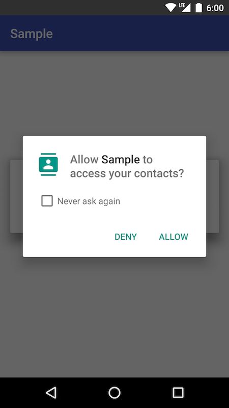
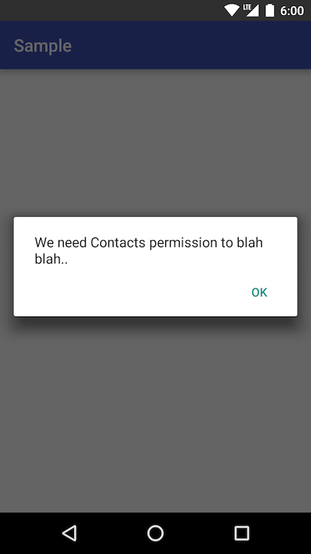

# Permission Manager

## Assumptions
This library is designed around two assumptions about how developers/designers will want to ask for run-time permissions:

1. Any Fragment/Activity, at any time might request a permission. This might result in multiple components all asking for one or more permission *at the same time*.

2. Developers will want to display a permission rationale in a uniform constant way: a simple Dialog.

## Usage

```
public class MyActivity extends AppCompatActivity {

    private PermissionListener mListener;

    @Override
    protected void onStart() {
        super.onStart();

        // create a listener
        mListener = new PermissionListener() {
            @Override
            public void onResult(boolean permissionGranted) {
                // handle boolean
            }
        };

        // ask for permission
        PermissionManager.askForPermission(this,
                Manifest.permission.GET_ACCOUNTS,
                mListener,
                "We need Contacts permission to blah blah..");
    }
```
Once a permission is asked for, PermissionManager will handle all interactions with the system to ensure the user can grant or deny a permission:



If the system decides it needs to show a rationale message, Permission Manager will automatically handle displaying a Dialog:




