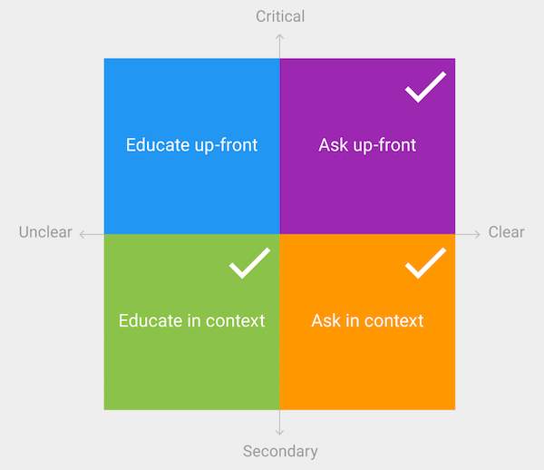

# PermissionManager

Easily and seamlessly ask for Android runtime permissions.

## Assumptions
This library is designed around two assumptions about how developers/designers will want to ask for runtime permissions:

1. Any Fragment/Activity, at any time might request a permission. This might result in multiple components all asking for one or more permission *at the same time*.

2. Developers will want to display an *in context* permission rationale in a uniform constant way: a simple Dialog.

## Goals
1. K.I.S.S.
2. Hard-code [Material design best practices](https://www.google.com/design/spec/patterns/permissions.html)
2. Reduce boiler plate
2. Limit library size and method count


## Responsibilities
PermissionManager helps streamline educating users about permissions and asking for those permissions, by wrapping interactions with the system's permission framework. No matter when or where in your app you need to ask for permissions PermissionManager can help. When you need to provide a rationale in context to the user, PermissionManager can help. 

If you need to provide an up-front explanation to the user, you'll have to implement that yourself. It's not something that requires interaction with the system's permission framework, so PermissionManager won't be able to help.

<p align="center">
	
</p>

## Usage
Start by initializing PermissionManager, preferably inside your application:

```
public class SampleApplication extends Application {

    @Override
    public void onCreate() {
        super.onCreate();

        PermissionManager.initialize(this);
    }
}
```

You can initialize PermissionManager with any `Context`, it will hold reference to ApplicationContext, so no need to worry about leaking an Activity. Every time you initialize PermissionManager it will reset any list of pending requests.


At any point in your application, you can request a permission. Just ask the PermissionManager for permission, passing in an Activity, the permission being requested, a rationale message, and a PermissionListener to handle the response. The method signature makes it easy to use a lambda syntax

```
public class MyActivity extends AppCompatActivity {

    private PermissionListener mPermissionListener;

    @Override
    protected void onStart() {
        super.onStart();

        // ask for permission
        PermissionManager.askForPermission(this,
                Manifest.permission.GET_ACCOUNTS,
                "We need Get Accounts permission to access contacts.",
                mPermissionListener = (permissionGranted) -> showToast(permissionGranted)
        );
    }
}
```
Once a permission is asked for, PermissionManager will handle all interactions with the system to ensure the user can grant or deny a permission:

<p align="center">
	
</p>

When the user responds to the permission dialog, your `PermissionListener` will be notified of the result.

If the system decides it needs to show a rationale message, PermissionManager will automatically handle displaying a Dialog:

<p align="center">
	
</p>

Finally, be sure to unregister all PermissionListeners manually.

```
public class MyActivity extends AppCompatActivity {

    private PermissionListener mPermissionListener;

    ...

    @Override
    protected void onDestroy() {
        super.onDestroy();
        PermissionManager.unregister(mPermissionListener);
    }
}
```

That's it, that's all there is to it! You decide what happens when a user grants or denies permission. Remember to follow the [Material guidelines on handling denied permissions](https://www.google.com/design/spec/patterns/permissions.html#permissions-request-patterns).

## Extended Usage

The main goal of this library is that any Fragment or Activity can request any permission(s) at any time. PermissionManager can handle all of the following scenarios.

#### Multiple components, asking for the same permission
If multiple components ask for the same permission at the same time, the user will be presented with the permission and rationale dialogs *only once*. Each component's PermissionListener will then be notified of the user's decision.

#### Multiple components, asking for different permissions
If multiple components each ask for a different permission at the same time, the user will be presented with the permission and rationale dialogs once for each permission.

#### Multiple components, asking for different permissions, but in the same permission group
If multiple components each ask for a different permission *but within the same permission group* at the same time, the user will be presented with the permission and rationale dialogs *only once*. Each component's PermissionListener will then be notified of the user's decision.

## Sample App
Check out the attached Sample app for implementation examples and demonstrations of the extended usage use-cases.

##RoadMap

#### MVP / dog food

- [X] one component asking for one permission
- [X] multiple components asking for same permission at the same time
- [X] multiple components each asking for different permission at same time
- [ ] one component asking for multiple permissions
- [ ] multiple components asking for multiple permissions at the same time, with some overlap
- [X] manual testing via the Sample App
- [ ] [handling non-existent permissions](https://commonsware.com/blog/2015/11/09/you-cannot-hold-nonexistent-permissions.html)

#### Version 1.0
- [ ] Travis building
- [ ] automated testing
- [ ] Maven Central release
- [ ] provide custom Theme to rationale dialog

#### Beyond
- [ ] handling custom permissions
- [ ] check that permission is listed in android manifest, if not crash and log
- [ ] since system grants normal permissions by default, we should just ignore those requests


